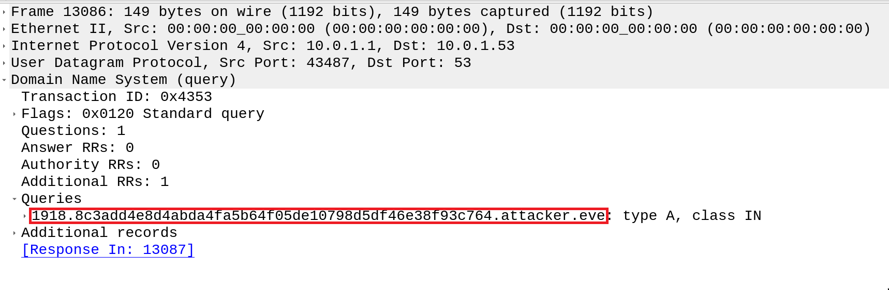

# OliCyber.IT 2021 - Competizione nazionale

## [network-2] Dispositivo Non Sicuro (25 risoluzioni)

La descrizione della challenge ci suggerisce che in qualche modo dei dati siano stati rubati all'azienda. Dovremo quindi analizzare il traffico presente nel file pcap per trovare i dati esfiltrati.

### Soluzione

Aprendo il file pcap con Wireshark, possiamo subito notare come ci siano una quantità estremamente alta e inusuale di pacchetti con protocollo DNS. In particolare, aprendo uno qualunque dei pacchetti, possiamo notare che le query DNS contengono un dominio particolarmente sospetto:



Analizzando anche le altre query DNS, possiamo dedurre che ognuna di esse è costruita sempre nello stesso modo: `{incremental_counter}.{data_in_hex}.attacker.eve`. Gli hacker hanno utilizzato un attacco di tipo DNS exfiltration, suddividendo i dati sensibili in sequenze che vengono inserite nei nomi di dominio delle query DNS, codificate in esadecimale.
Possiamo quindi estrarre tutti i segmenti `data_in_hex`, concatenarli e decodificare il risultato.

Il risultato ottenuto è un file .zip che contiene 3 foto, una delle quali contiene a sua volta la flag.

### Exploit

Un modo per estrarre tutti i nomi delle query DNS è utilizzare `tshark`:

```bash
tshark -r capture.pcapng -Y 'dns.flags.response eq 0 and dns.qry.name contains "attacker.eve"' -T fields -e dns.qry.name > export
```

- L'opzione `-r capture.pcapng` specifica quale file leggere in input per l'esportazione.
- L'opzione `-Y` specifica come filtrare i pacchetti: verranno tenuti solo quelli che sono una query DNS (`dns.flags.response eq 0`) e il cui nome contiene la stringa sospetta (`dns.qry.name contains "attacker.eve"`).
- L'opzione `-T fields -e dns.qry.name` specifica di esportare solo la colonna contenente il nome di dominio nella query DNS.

Il file `export` dovrebbe contenere una sequenza di stringhe di questo tipo:

```
0000.504b03040a0000000000f5b9b25200000000000000000000.attacker.eve
0001.00000f001c00646174692d73656e736962696c692f555409.attacker.eve
0002.00037d2ea4607d2ea46075780b000104e803000004e80300.attacker.eve
0003.00504b030414000200080033b1b25267e173b1a8c300003b.attacker.eve
0004.c400001f001c00646174692d73656e736962696c692f6761.attacker.eve
0005.74746f2d73656c6669652e6a70675554090003011fa4603e.attacker.eve
0006.25a46075780b000104e803000004e803000094fd75549bcf.attacker.eve
0007.173e8aa6405bb4b85b7177f712dc9de294e0ee6e1fdc2540.attacker.eve
0008.7129eed0e04ed1e0aec5dd3db8dd7e7fe79eb3eebdffdd49.attacker.eve
0009.b2929599cc9a99fdecbd9ffdbe333bef4bef9b000c796939.attacker.eve
...
```

E' ora sufficiente tagliare la parte iniziale e finale di ogni stringa, decodificare il formato esadecimale e scrivere i byte risultanti in un file:

```python
data = []
with open('export', 'r') as infile:
    for line in infile:
        data.append(line.split('.')[1])

with open('output', 'wb') as outfile:
    for line in data:
        outfile.write(bytes.fromhex(line))
```

Eseguendo il comando `file output` si può scoprire che il file è un archivio zip. Estraendone il contenuto si trova la flag.

Soluzione oneliner:

```sh
tshark -r capture.pcapng -Y 'dns.flags.response eq 0 and dns.qry.name contains "attacker.eve"' -T fields -e dns.qry.name | cut -d. -f2 | tr -d '\n' | xxd -r -p - > exfiltrated_data && unzip exfiltrated_data
```
