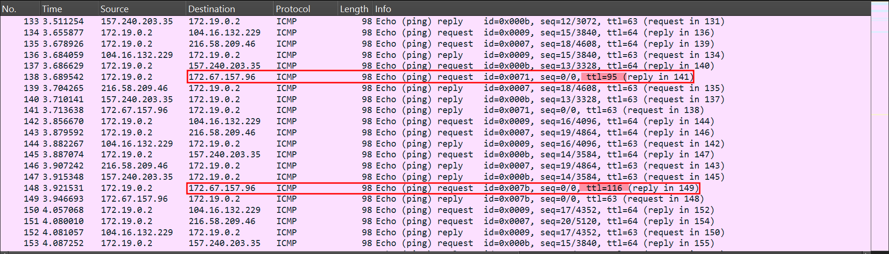

# OliCyber.IT 2025 - Competizione nazionale

## [misc] Live and Let Die (41 solves)

Agitato, non mescolato

Author: Lorenzo Catoni <@lorenzcat>

## Panoramica

La challenge fornisce in allegato un file `.pcap`, all'interno del quale si trovano principalmente pacchetti ICMP (ping).
Analizzando i pacchetti si nota che alcuni hanno un valore di TTL differente dagli altri. In particolare, tutti quelli provenienti dall’indirizzo IP `172.67.157.96` presentano valori anomali.



L’idea è quella di estrarre solo i valori di TTL dei pacchetti diretti a quell’indirizzo e concatenarli per ottenere la flag.

## Soluzione

Per filtrare solamente i pacchetti ICMP diretti all’indirizzo `172.67.157.96`, si può utilizzare il comando `tshark` con lo switch `-Y 'icmp && ip.dst == 172.67.157.96'`.
Per stampare solo i valori del TTL, si specifica l’opzione `-T fields -e ip.ttl`. Il comando completo diventa:

```bash
tshark -r lld.pcap -Y 'icmp && ip.dst == 172.67.157.96' -T fields -e ip.ttl
```

Successivamente, convertendo i valori ottenuti in ASCII e concatenandoli, si ricava la flag.

## Exploit

```py
import subprocess
import sys

cmd = f"tshark -r {sys.argv[1]} -Y'icmp && (ip.dst == 172.67.157.96 || ip.dst == 104.21.89.84)' -Tfields -eip.ttl"
output = subprocess.check_output(["sh", "-c", cmd])
ttls = [int(o) for o in output.decode().strip().split('\n')]
print(bytes(ttls))
```
