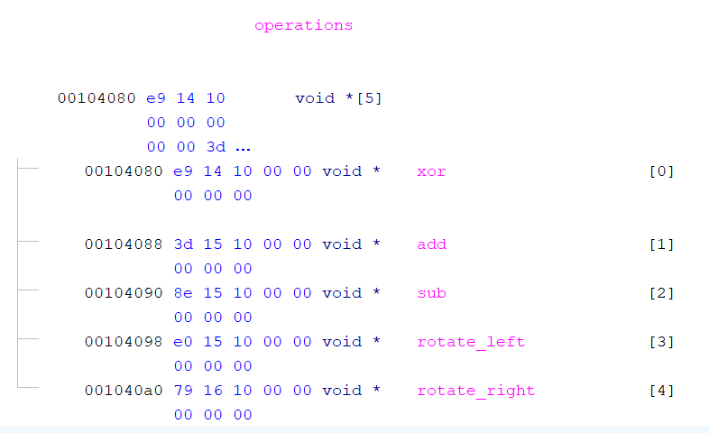
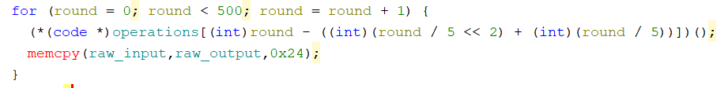

# OliCyber.IT 2025 - Selezione territoriale

## [rev] Magic black box (13 risoluzioni)

Magic black box! Nessuno sa cosa succeda dentro, ma confido che tu possa scoprirlo!

`nc magicbb.challs.olicyber.it 1337`

Autore: Giulia Martino <@Giulia>

## Panoramica

La challenge è un binario che chiede in input una sequenza di bytes (in hex) e ci esegue sopra delle operazioni. Alla fine delle operazioni confronta l'output con una stringa hex hardcoded nel binario stesso; se i due output sono uguali, stampa la flag. L'obiettivo della challenge è comprendere quali siano le operazioni che sta effettuando sull'input, invertirle, ed eseguirle sulla stringa di output che il programma si aspetta così da ottenere l'input che la ha generata.

## Soluzione

E' possibile analizzare il binario utilizzando un tool come Ghidra per l'analisi statica. Cominciando dal main, la challenge legge in ingresso `0x48` bytes che salva su una variabile globale, `hex_input`. Questa variabile viene passata come parametro alla funzione `hex_to_bytes` che, come suggerisce il nome, trasforma la stringa esadecimale in una sequenza di bytes, salvata nella variabile globale `raw_input`.

La challenge chiama poi la funzione `magic_black_box` e successivamente la funzione `bytes_to_hex` che trasforma la sequenza di bytes `raw_output` in una stringa esadecimale `hex_output`. La stringa `hex_output` viene infine confrontata con la variabile globale `hex_final`: se le due sono uguali, la flag è stampata a schermo.

Il funzionamento delle funzioni `hex_to_bytes` e `bytes_to_hex` può essere dedotto dal loro nome senza la necessità di reversarle. Si può inoltre dedurre che la funzione `magic_black_box` esegua operazioni su `raw_input` e salvi il risultato finale nella variabile `raw_output`.

### `magic_black_box`

Per prima cosa, la funzione chiama `srand(0x1337)` per inizializzare un PRNG. Essendo il seed fissato e conosciuto, è possibile ricostruire l'intera sequenza di numeri pseudo casuali che la challenge genera. Due modi molto semplici per farlo sono:

1. Scrivere un brevissimo programma in C che generi e stampi quei numeri, compilarlo, ed eseguirlo. Per esempio:

```c
#include <stdlib.h>
#include <stdio.h>

int main() {
    srand(0x1337);
    for (int i = 0; i < 0x2000; i++) {
        printf("%d, ", rand());
    }
}

// gcc -o gen gen.c
```

2. Utilizzare Python per ricostruire la sequenza. Per esempio:

```python
from ctypes import CDLL

libc = CDLL("libc.so.6")
libc.srand(0x1337)

nums = [libc.rand() for _ in range(0x2000)]

print(", ".join(map(str, nums)))
```

Successivamente, la challenge entra in un loop che viene eseguito 500 volte; ad ogni iterazione, la challenge accede ad una variabile globale `operations`. Questa variabile è un array di 5 puntatori a funzione, ognuno che corrisponde ad un'operazione diversa; effettuando il re-type della variabile ad un array (e.g. `void *[5]`) è possibile visualizzarne chiaramente il contenuto:



Ad ogni round di iterazione, una sola di queste funzioni viene chiamata ed eseguita. In particolare, se si utilizza Ghidra, il decompilato mostrerà qualcosa del genere:



L'espressione `round - ((round / 5 << 2) + (round / 5))`, però, non è altro che `round % 5`.

Per riassumere, quindi, la challenge esegue una alla volta tutte le operazioni dell'array in sequenza (`xor`, `add`, `sub`, `rotate_left`, `rotate_right`), per 100 volte (per un totale di 500 operazioni).

Le cinque funzioni sono molto semplici da reversare: ognuna di esse esegue esattamente quello che dice il suo nome. Tutte, però, utilizzano la funzione `rand()` per aggiungere randomness all'operazione:

1. La funzione `xor` esegue lo xor di ogni byte di `raw_input` con un byte random.
2. La funzione `add` aggiunge ad ogni byte di `raw_input` un byte random.
3. La funzione `sub` sottrae ad ogni byte di `raw_input` un byte random.
4. La funzione `rotate_left` ruota `raw_input` verso sinistra di un numero di posizioni random.
5. La funzione `rotate_right` ruota `raw_input` verso destra di un numero di posizioni random.

Considerato che conosciamo l'intera sequenza di numeri generati dalla funzione `rand`, possiamo semplicemente eseguire una alla volta tutte e 500 le operazioni invertite e in ordine inverso, partendo dall'output che ci aspettiamo fino ad arrivare alla stringa che lo genera.

L'operazione `xor` si inverte con se stessa, mentre `add`-`sub` e `rotate_left`-`rotate_right` si invertono a vicenda. Le operazioni da eseguire saranno quindi: `rotate-left`, `rotate-right`, `add`, `sub`, `xor`, per 100 volte (per un totale di 500 operazioni).

## Exploit

```python
#!/usr/bin/env python3

import os

hex_expected_output = "1f84e6290b29a50954607fb2ad6615796a522d688d89acffe95a771ce9ba0d12b0288d7c"
raw_expected_output = list(bytes.fromhex(hex_expected_output))

with open('nums.txt', "r") as f:                    # C rand() numbers sequence
   nums = [int(x) for x in f.read().split(", ")]

rand_used = 0
def rand():
   global rand_used
   rand_used -= 1
   return nums[rand_used]

HEX_LEN = len(hex_expected_output)
RAW_LEN = HEX_LEN // 2

raw_input = raw_expected_output
raw_output = [0] * RAW_LEN

def xor():
   key = rand() & 0xFF
   for i in range(RAW_LEN):
      raw_output[i] = raw_input[i] ^ key

def add():
   key = rand() & 0xFF
   for i in range(RAW_LEN):
      raw_output[i] = (raw_input[i] + key) & 0xFF

def sub():
   key = rand() & 0xFF
   for i in range(RAW_LEN):
      raw_output[i] = (raw_input[i] - key) & 0xFF

def rotate_left():
   rotation = rand() % RAW_LEN
   for i in range(RAW_LEN):
      raw_output[i] = raw_input[(i + rotation) % RAW_LEN]

def rotate_right():
   rotation = rand() % RAW_LEN
   for i in range(RAW_LEN):
      raw_output[i] = raw_input[(i + RAW_LEN - rotation) % RAW_LEN]

operations = [xor, sub, add, rotate_right, rotate_left] # Inverted operation orders to invert them

NUM_OPERATIONS = len(operations)
NUM_ROUNDS = rand_used = NUM_OPERATIONS * 100

for round in reversed(range(NUM_ROUNDS)):
   operation = round % NUM_OPERATIONS
   operations[operation]()

   raw_input = raw_output.copy()

hex_output = bytes(raw_input).hex()

print("[+] hex_output", hex_output)

```
